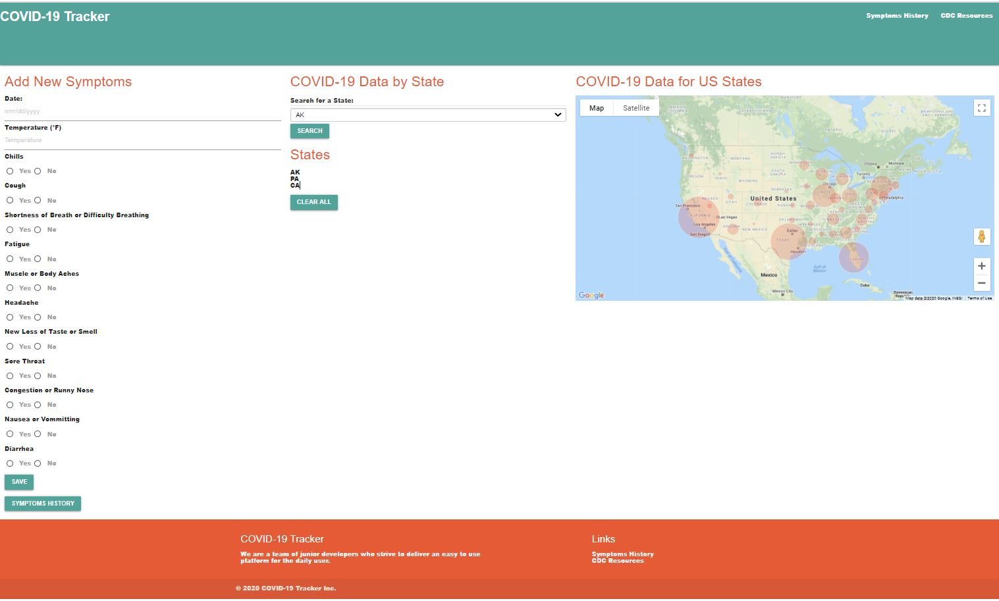
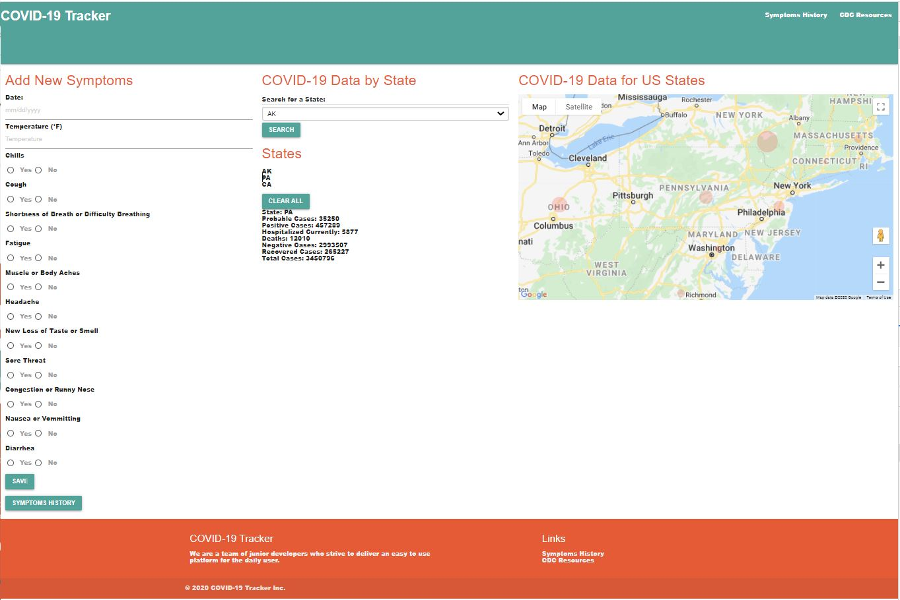
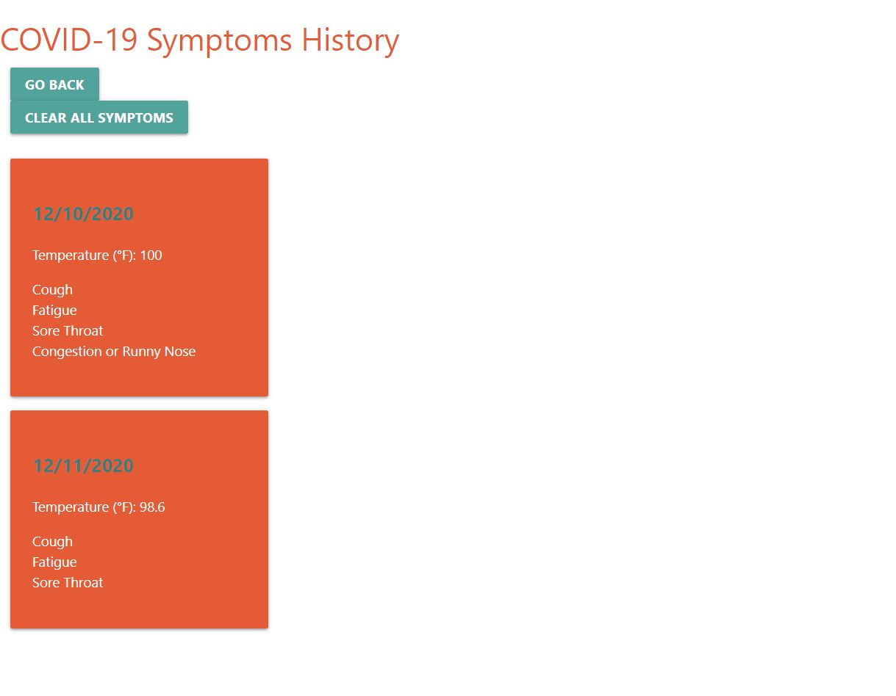

# **COVID-19** **Tracker**

The COVID-19 Tracker is brought to you by a group of students from the UPenn LPS Coding Bootcamp. This appliation provides a user an easy to use platform where he/she can choose from a list of the most common COVID-19 symptoms (As listed on the CDC website)and save their selections for the purpose of keeping a well organized log. In addition, the main screen has a visualization of COVID-19 cases for the US, enabling the user to stay up to date on several high level metrics for each state  

## **Contributors**

- Rae Stichter

- Zoe King

- Braudy Herrera

## Project Requirements

- Use a CSS framework other than Bootstrap.

- Be deployed to GitHub Pages.

- Be interactive (i.e., accept and respond to user input).

- Use at least two server-side APIs.

- Does not use alerts, confirms, or prompts (use modals).

- Use client-side storage to store persistent data.

- Be responsive.

- Have a polished UI.

- Have a clean repository that meets quality coding standards (file structure, naming conventions, follows best practices for class/id naming conventions, indentation, quality comments, etc.).

- Have a quality README (with unique name, description, technologies used, screenshot, and link to deployed application).

- Finally, you must add your project to the portfolio that you created in Module 2.

## Technologies Used

- Materialize CSS Framework
- Pure CSS Framework
- JQuery
- APIs: Open Source Covid Project, Google Maps

## Screenshot

  
  

## Links

- Deployed: https://raestichter.github.io/covid-tracker/  
- GitHub repo: https://github.com/RaeStichter/covid-tracker.git   
